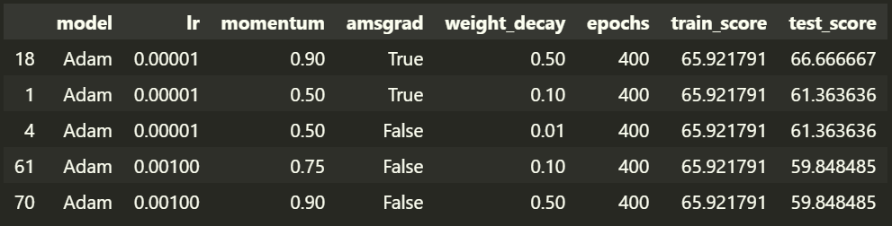
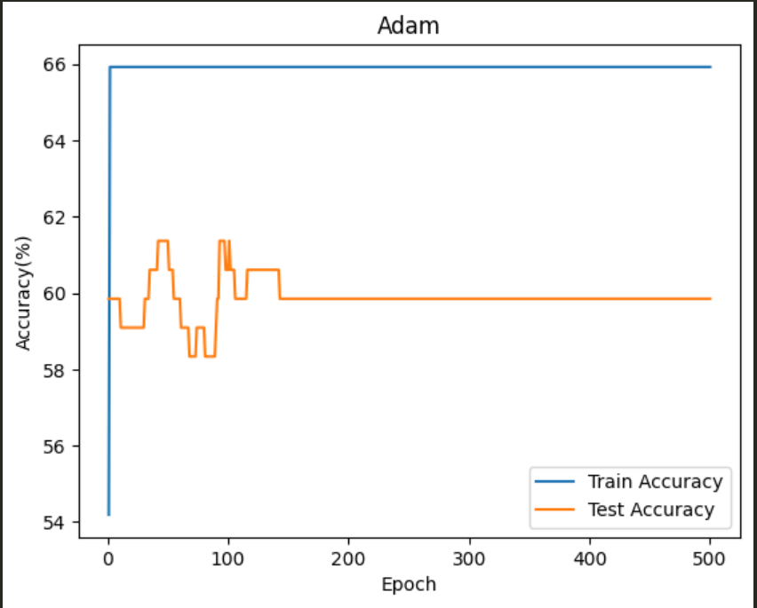
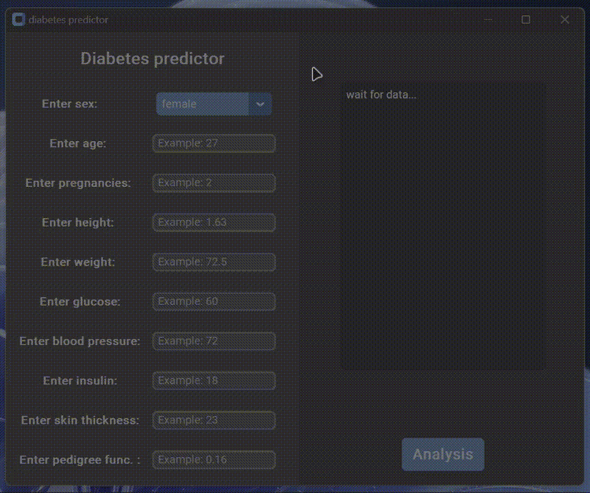

# diabetes-classifier

### *--pytorch  2.1.1*
### *--numpy    1.26.0*
### *--pandas   2.1.1*
### *--matplotlib   3.8.0*
### *--seaborn   0.13.0*
### *--scikit-learn    1.3.2*
### *--customtkinter    5.2.2*

## ❗❗❗ The goal of this study was to create a model that could predict, based on patient data, whether he has diabetes or not.

#### *It was decided to use two potentially most suitable methods for solving the problem - a neural network and a forest.*  

#### *By experimenting with the number of hidden layers, the number of neurons and the activation function, the final model had 3 hidden layers of 256 neurons and one of 32. Adam was chosen as the optimizer (also experimentally). all other superparameters were selected by selecting the most effective model and further fine-tuning the parameters.*  

```
class NeuralNetwork(nn.Module):

    '''
    =============================
    This class initializes the neural network model. 
    The init function has several hidden layers, 
    the parameters of which are configured in the widget above
    =============================
    '''
    
    def __init__(self):
        super(NeuralNetwork, self).__init__()
        self.fc1 = nn.Linear(8, int_layer_size_widget.value)
        init.trunc_normal_(tensor=self.fc1.weight,mean=0,std=0.1,a=-1,b=1)

        self.dropout1 = nn.Dropout(0.5)  
        self.fc2 = nn.Linear(int_layer_size_widget.value, hide_layer_size_widget.value)
        init.trunc_normal_(tensor=self.fc2.weight,mean=0,std=0.1,a=-1,b=1)

        self.dropout2 = nn.Dropout(0.5)
        self.fc3 = nn.Linear(hide_layer_size_widget.value, hide_layer_size_widget.value)
        init.trunc_normal_(tensor=self.fc3.weight,mean=0,std=0.1,a=-1,b=1)

        self.dropout3 = nn.Dropout(0.5)
        self.fc4 = nn.Linear(hide_layer_size_widget.value,1)
        init.trunc_normal_(tensor=self.fc4.weight,mean=0,std=0.1,a=-1,b=1)

        self.sigmoid = nn.Threshold(threshold=threshold_widget.value,value=0)
    
    def forward(self, x):
        x = F.tanh(self.fc1(x))

        x = self.dropout1(x)
        x = F.tanh(self.fc2(x))

        
        x = self.dropout2(x)
        x = F.tanh(self.fc3(x))

        x = self.dropout3(x)
        x = F.tanh(self.fc4(x))

        x = self.sigmoid(x)
        x = torch.round(x)
        return x
```

#### the learning process mode can be seen on the graph



## ❗ As a result, the neural network model turned out to be not a very good option, since it can achieve accuracy even higher than 62%. The maximum value that could be achieved was 72%t.

### The Sklearn library has its own characteristics and problems, but in order not to implement the tree model, it was decided to use a ready-made solution. The tree model already had better accuracy, 80.2%. Parameters: max_depth = 12, max_features = 8, max_leaf= 12


```
tree_classifier_model = tree.DecisionTreeClassifier(max_depth = max_depth_widget.value,
                                max_features = max_features_widget.value, 
                                max_leaf_nodes= max_leaf_nodes_widget.value)
tree_classifier_model = tree_classifier_model.fit(X_train, y_train)

y_pred = tree_classifier_model.predict(X_test)
accuracy = accuracy_score(y_test, y_pred)
print(f"Accuracy: {100 * accuracy:.4} %")
```

## ❗ Based on the successful model, a small GUI program was written.

